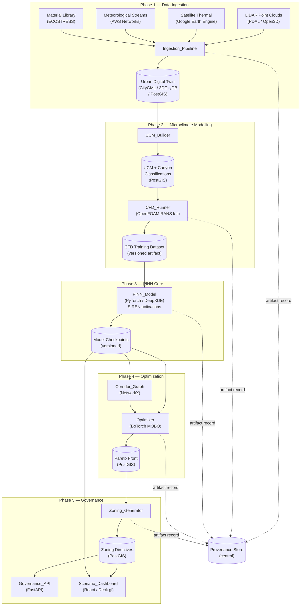

# Design Document: Micro-Climate Zoning AI

## Overview

The Micro-Climate Zoning AI is a five-phase pipeline that transforms raw urban sensor data into physics-grounded, block-level zoning legislation. The system treats the city as a living thermodynamic system: it fuses LIDAR geometry, satellite thermal imagery, meteorological streams, and material property libraries into a voxelized Urban Digital Twin (UDT), then applies Physics-Informed Neural Networks (PINNs) and Multi-Objective Bayesian Optimization (MOBO) to generate legally structured zoning amendments that reduce Urban Heat Island (UHI) intensity while preserving wind corridors, green cover, and democratic governance.

The system is explicitly designed to augment — not replace — human planners and elected bodies, who retain full legal authority over all zoning decisions. The AI generates evidence-grounded options with quantified trade-offs; governance remains human.

### Design Goals

- **Physics fidelity**: All predictions are grounded in Navier-Stokes and energy balance equations, not purely statistical correlations.
- **Auditability**: Every zoning directive is traceable to its source data, model checkpoint, and optimization run.
- **Inference speed**: PINN inference at ~0.3 s/block enables real-time planner interaction.
- **Equity awareness**: Community heat index and displacement risk are first-class outputs, not afterthoughts.
- **Operational continuity**: Quarterly retraining with drift detection keeps predictions accurate as the city evolves.

---

## Architecture

The system is organized as a directed acyclic pipeline with five phases. Each phase produces versioned artifacts consumed by the next. A central provenance store records all artifact lineage.



### Key Architectural Decisions

**Decision 1 — PINN as differentiable surrogate**: Rather than running OpenFOAM at optimization time (48–72 h/run), the PINN acts as a ~0.3 s differentiable surrogate. This makes Monte Carlo sweeps and gradient-based acquisition functions tractable. The trade-off is that PINN accuracy is bounded by the 200 CFD training samples; this is mitigated by physics constraints in the loss function.

**Decision 2 — Shared encoder, dual heads**: The wind and energy prediction heads share a common 8-layer SIREN encoder. This forces the model to learn a unified thermodynamic representation of block geometry, reducing overfitting and enabling the buoyancy coupling term (ρg·β(T − T∞)) to propagate gradients between the two fields.

**Decision 3 — Hard corridor constraints before MOBO**: Wind corridor bottlenecks are identified via NetworkX minimum-cut analysis and assigned hard height caps before the MOBO search begins. This prevents the optimizer from trading away irreversible cooling infrastructure for marginal gains on other objectives.

**Decision 4 — PostGIS as the integration bus**: All versioned artifacts (UDT, UCM, CFD results, Pareto configurations, zoning directives) are stored in PostGIS with spatial indexing. This gives every downstream component a single queryable source of truth and enables the provenance store to link artifacts by spatial extent.

**Decision 5 — Transfer learning for city portability**: The base PINN is pre-trained on 200 CFD samples. For a new city, only the final 2 layers of each head are fine-tuned on 10–15 local weather station measurements. This keeps deployment cost low while preserving the physics constraints learned during pre-training.

---

## Components and Interfaces

### 5.1 Ingestion_Pipeline

**Responsibility**: Acquire, preprocess, and fuse all raw data streams into the UDT.

**Key operations**:
- LIDAR ground classification (CSF algorithm via PDAL), building polygon extrusion (alpha-shape reconstruction via Open3D), LoD-2 mesh generation.
- Satellite thermal co-registration (homography transforms), cloud-masking (NDVI × NDWI).
- Meteorological resampling to 1-hour timestep (kriging interpolation for sparse zones).
- Material classification (Random Forest on ECOSTRESS Spectral Library, ≥5,000 signatures), assigning α, ε, ρCp per surface.
- UDT voxelization at 2m × 2m × 2m resolution.
- Input validation: LIDAR density (20–50 pts/m² for ≥90% of extent), emissivity correction metadata presence.

**Interface**:
```python
class IngestionPipeline:
    def ingest(
        self,
        lidar_path: Path,
        satellite_path: Path,
        met_station_paths: list[Path],
        material_library_path: Path,
    ) -> UDTArtifact:
        """
        Returns a UDTArtifact with version_id, spatial extent, and PostGIS table reference.
        Raises IngestionValidationError for missing or invalid streams.
        Logs structured warnings for sub-threshold regions; continues on partial failure.
        """
```

**Error handling**: Partial stream failures are logged with stream name, failure reason, and affected spatial extent. Processing continues on available streams. Missing emissivity metadata causes hard rejection of the affected satellite image.

---

### 5.2 UCM_Builder

**Responsibility**: Compute morphological indices and canyon classifications for every city block in the UDT.

**Morphological indices computed**: SVF, λp, λf, H/W, z₀.

**Canyon classification schema**:
| H/W | Class | Turbulence treatment |
|---|---|---|
| > 2.5 | `deep_canyon` | Deterministic single-vortex model |
| 1 – 2.5 | `regular_canyon` | Counter-rotating vortex pair |
| < 1 | `shallow_canyon` | Skimming flow regime |
| Variable (adjacent blocks) | `transitional_zone` | Stochastic perturbation parameters assigned |

**Interface**:
```python
class UCMBuilder:
    def build(self, udt_artifact: UDTArtifact) -> UCMArtifact:
        """
        Computes morphological indices for all blocks and persists to PostGIS.
        Validates input fields (height 0–600m, block area > 0 m²).
        Returns UCMArtifact with version_id and PostGIS table reference.
        """
```

---

### 5.3 CFD_Runner

**Responsibility**: Orchestrate OpenFOAM RANS k-ε simulations on 200 stratified morphology samples to generate PINN training data.

**Stratification**: Samples are drawn to ensure coverage across all four canyon classification types. Stratification uses Latin Hypercube Sampling over the morphological index space.

**Validation**: Each completed simulation is checked for mass conservation (∇·u = 0 residual < 1×10⁻⁴). Failed or non-converged runs are logged and flagged for re-run.

**Interface**:
```python
class CFDRunner:
    def generate_training_dataset(
        self,
        ucm_artifact: UCMArtifact,
        n_samples: int = 200,
    ) -> CFDDatasetArtifact:
        """
        Runs OpenFOAM simulations, validates outputs, and returns a versioned
        CFDDatasetArtifact. Each sample record includes: sample_id, morphology
        parameters, wind fields (u,v,w,P), energy fields (Qh,Qe,ΔQs,Q*),
        mass_conservation_residual, and status (valid | failed).
        """
```

---

### 5.4 PINN_Model

**Responsibility**: Multi-head neural network predicting wind and energy fields for any block configuration, with physics constraints embedded in the loss function.

**Architecture**:
- Shared encoder: 8-layer MLP, 512 neurons/layer, SIREN (sin) activations.
- Wind head: outputs (u, v, w, P) at every voxel.
- Energy head: outputs (Qh, Qe, ΔQs, Q*) at every voxel.
- Loss: L_total = L_data + λ₁·L_NS + λ₂·L_energy + λ₃·L_BC.

**Serialization**: Full state (architecture config, weights, λ₁/λ₂/λ₃, training dataset version, fine-tuning city ID, timestamp) serialized to a versioned checkpoint file. Round-trip fidelity is a hard requirement (see Correctness Properties).

**Interface**:
```python
class PINNModel:
    def predict(self, block_feature_vector: Tensor) -> PINNPrediction:
        """Returns wind and energy fields. Attaches OOD warning flag if any
        feature is beyond 3σ from training distribution mean."""

    def predict_with_jacobian(self, block_feature_vector: Tensor) -> tuple[PINNPrediction, Tensor]:
        """Returns prediction and ∂output/∂input Jacobian for optimizer use."""

    def save_checkpoint(self, path: Path) -> CheckpointArtifact:
        """Serializes full model state. Returns artifact with version_id."""

    @classmethod
    def load_checkpoint(cls, path: Path) -> "PINNModel":
        """Loads and validates checkpoint. Raises CheckpointError on corruption
        or architecture mismatch. Never returns a partially initialized model."""

    def fine_tune(
        self,
        weather_station_measurements: list[WeatherMeasurement],
        freeze_encoder: bool = True,
    ) -> None:
        """Fine-tunes final 2 layers of each head only. Encoder weights unchanged."""
```

---

### 5.5 Optimizer (MOBO Engine)

**Responsibility**: Use the PINN as a differentiable surrogate to search the urban morphology space for Pareto-optimal configurations minimizing UHI intensity.

**Algorithm**: Multi-Objective Bayesian Optimization (BoTorch) with PINN Jacobians as acquisition function priors.

**Decision variables**: building heights, setbacks, roof albedo targets, green-roof fraction, street tree canopy %, pavement material.

**Hard constraints** (enforced before MOBO search):
- FAR_block ≤ FAR_max
- ΔH_block ≤ ΔH_permitted
- Wind_corridor[k] ≥ V_min (from Corridor_Graph)
- Green cover ≥ 15% of block area
- Σ cost(x) ≤ budget_total

**Secondary objectives**: maximize PET index, preserve solar access ≥ 4 h/day, minimize retrofit cost.

**Interface**:
```python
class Optimizer:
    def build_corridor_graph(self, pinn_model: PINNModel) -> CorridorGraph:
        """Constructs NetworkX graph; applies minimum-cut to identify bottleneck blocks."""

    def optimize(
        self,
        ucm_artifact: UCMArtifact,
        pinn_model: PINNModel,
        corridor_graph: CorridorGraph,
        constraints: OptimizationConstraints,
    ) -> ParetoFrontArtifact:
        """
        Returns 50–200 non-dominated configurations.
        Raises InfeasibilityError with conflicting constraint details if constraints
        are mutually infeasible before optimization begins.
        """
```

---

### 5.6 Zoning_Generator

**Responsibility**: Translate Pareto-optimal configurations into machine-readable, legally structured zoning directives with full provenance trails.

**Zone classes**: `WIND_CORRIDOR_CRITICAL`, `THERMAL_REMEDIATION`, `DENSITY_ADAPTIVE`, `BASELINE_UNCHANGED`.

**Community heat index**: Computed per ward — total cooling benefit (ΔT × block area), total retrofit cost, displacement risk score. Wards above the displacement risk threshold are auto-flagged for equity review.

**Interface**:
```python
class ZoningGenerator:
    def generate(
        self,
        pareto_config: ParetoConfiguration,
        provenance: ProvenanceRecord,
    ) -> list[ZoningDirective]:
        """
        Produces one ZoningDirective per affected block.
        Validates each directive against the JSON schema before storage.
        Round-trip property: parse(serialize(directive)) == directive.
        """

    def compute_community_heat_index(
        self,
        directives: list[ZoningDirective],
        ward_map: WardMap,
    ) -> list[WardHeatIndex]:
        """Aggregates per-ward metrics; flags wards above displacement risk threshold."""
```

---

### 5.7 Governance_API

**Responsibility**: FastAPI REST service for real-time permit compliance checking.

**Endpoints**:

| Method | Path | Description |
|---|---|---|
| `POST` | `/v1/permit/check` | Check permit application against active zoning directive |
| `GET` | `/v1/directive/{directive_version_id}/provenance` | Return full provenance record for a directive |
| `GET` | `/v1/health` | Health check |

**Authentication**: API key (header `X-API-Key`). Unauthenticated requests → HTTP 401.

**Error responses**:
- Unknown block_id → HTTP 404 with descriptive message.
- Malformed payload → HTTP 422 with per-field validation errors.
- Unauthenticated → HTTP 401.

**Audit log**: Every permit check logged with timestamp, block_id, API key identifier (not value), and compliance outcome.

**Performance target**: p95 latency < 2 s under 100 concurrent requests.

---

### 5.8 Scenario_Dashboard

**Responsibility**: React/Deck.gl interactive map for city planners to explore zoning configurations and their thermal consequences.

**Key interactions**:
- Map renders all blocks color-coded by zone class and UHI intensity.
- Planner overrides a directive parameter → PINN invoked → ΔT displayed on all affected blocks within 5 s.
- Pareto front displayed as selectable list; selecting a configuration updates all block directives on the map.
- Community heat index panel shows per-ward cooling benefit, cost burden, and displacement risk.
- Wind corridor violation warning shown when an override would breach a hard constraint.

---

## Data Models

### UDT Voxel Cell
```python
@dataclass
class UDTVoxel:
    x: float          # easting (m)
    y: float          # northing (m)
    z: float          # elevation (m)
    geometry_type: str  # "building" | "ground" | "vegetation" | "air"
    albedo: float     # α ∈ [0, 1]
    emissivity: float # ε ∈ [0, 1]
    heat_capacity: float  # ρCp (J/m³/K)
    boundary_temp_k: float  # boundary thermal condition (K)
    material_class: str
```

### UCM Block Record
```python
@dataclass
class UCMBlock:
    block_id: str
    udt_version_id: str
    svf: float          # Sky View Factor ∈ [0, 1]
    lambda_p: float     # Plan Area Fraction ∈ [0, 1]
    lambda_f: float     # Frontal Area Index ∈ [0, 1]
    hw_ratio: float     # Mean Aspect Ratio H/W ≥ 0
    z0: float           # Roughness length (m) > 0
    canyon_class: Literal["deep_canyon", "regular_canyon", "shallow_canyon", "transitional_zone"]
    turbulence_perturbation_params: dict | None  # set for transitional_zone only
```

### CFD Sample Record
```python
@dataclass
class CFDSample:
    sample_id: str
    dataset_version_id: str
    morphology_params: dict          # UCM indices used as input
    wind_field: np.ndarray           # shape (Nx, Ny, Nz, 4) — (u, v, w, P)
    energy_field: np.ndarray         # shape (Nx, Ny, Nz, 4) — (Qh, Qe, ΔQs, Q*)
    mass_conservation_residual: float
    status: Literal["valid", "failed"]
```

### PINN Checkpoint Manifest
```python
@dataclass
class CheckpointManifest:
    version_id: str
    training_dataset_version: str
    fine_tuning_city_id: str | None
    training_timestamp: datetime
    architecture_config: dict        # layer counts, widths, activation type
    physics_coefficients: dict       # {"lambda_1": float, "lambda_2": float, "lambda_3": float}
    validation_mae: float            # mean absolute error on held-out set
```

### Zoning Directive (JSON Schema)
```json
{
  "$schema": "http://json-schema.org/draft-07/schema#",
  "type": "object",
  "required": [
    "block_id", "zone_class", "max_height_m", "height_justification",
    "permitted_uses", "mandatory_interventions", "compliance_deadline_months",
    "review_trigger", "provenance"
  ],
  "properties": {
    "block_id": { "type": "string" },
    "zone_class": {
      "type": "string",
      "enum": ["WIND_CORRIDOR_CRITICAL", "THERMAL_REMEDIATION", "DENSITY_ADAPTIVE", "BASELINE_UNCHANGED"]
    },
    "max_height_m": { "type": ["number", "null"] },
    "height_justification": { "type": "string" },
    "permitted_uses": { "type": "array", "items": { "type": "string" } },
    "mandatory_interventions": {
      "type": "array",
      "items": {
        "type": "object",
        "required": ["type", "cooling_effect_estimate_c"],
        "properties": {
          "type": { "type": "string" },
          "cooling_effect_estimate_c": { "type": "number" }
        }
      }
    },
    "compliance_deadline_months": { "type": "integer" },
    "review_trigger": { "type": "string" },
    "provenance": {
      "type": "object",
      "required": ["udt_version_id", "pinn_checkpoint_version", "cfd_sample_ids", "mobo_run_id"],
      "properties": {
        "udt_version_id": { "type": "string" },
        "pinn_checkpoint_version": { "type": "string" },
        "cfd_sample_ids": { "type": "array", "items": { "type": "string" } },
        "mobo_run_id": { "type": "string" }
      }
    }
  }
}
```

### Permit Application Payload
```python
@dataclass
class PermitApplication:
    block_id: str
    proposed_height_m: float
    proposed_far: float
    proposed_roof_albedo: float
    proposed_green_cover_pct: float  # 0–100
```

### Permit Compliance Response
```python
@dataclass
class ComplianceResponse:
    compliance_status: Literal["compliant", "non_compliant", "conditional"]
    violated_fields: list[str]       # empty if compliant
    active_directive_version_id: str
    checked_at: datetime
```

### Provenance Record
```python
@dataclass
class ProvenanceRecord:
    artifact_id: str
    artifact_type: str               # "udt" | "cfd_dataset" | "pinn_checkpoint" | "pareto_front" | "zoning_directive"
    producing_component: str
    input_artifact_ids: list[str]
    creation_timestamp: datetime
    metadata: dict
```

### Ward Heat Index
```python
@dataclass
class WardHeatIndex:
    ward_id: str
    total_cooling_benefit_c_m2: float   # Σ(ΔT × block_area)
    total_retrofit_cost: float
    displacement_risk_score: float      # 0–1
    equity_review_flagged: bool
```
